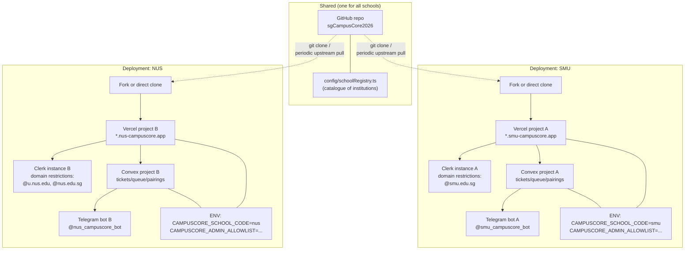
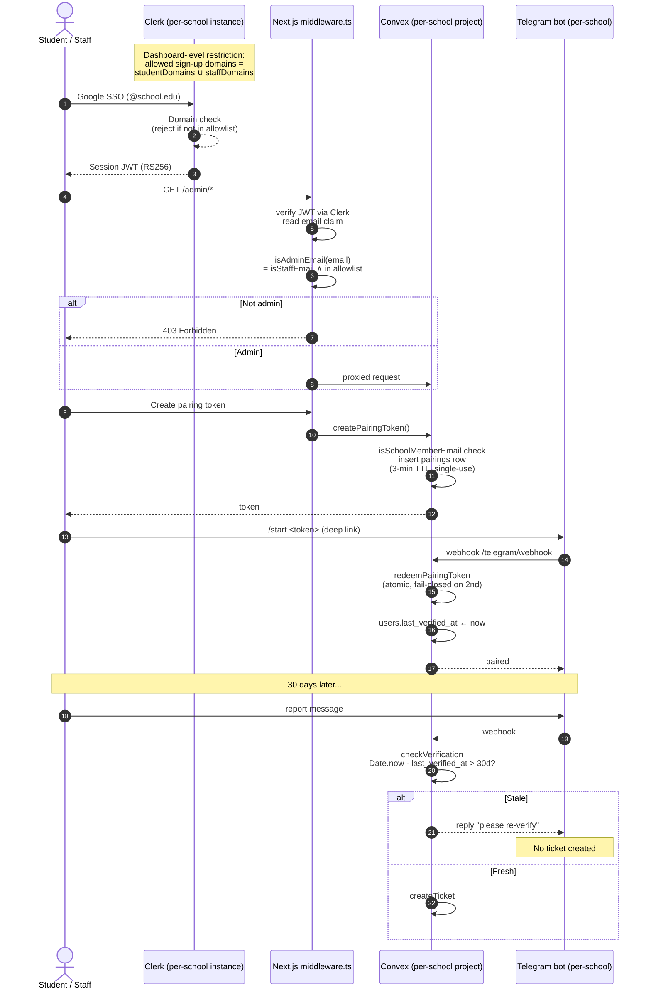
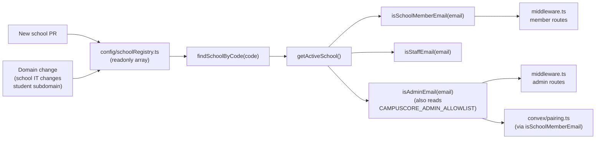

# Design Document: Multi-School Template Hardening

## Overview

CampusCore already ships a per-school template scaffold (`config/school.ts`,
`config/schoolRegistry.ts`, admin-allowlist gate in `middleware.ts`, single-use
pairing token, 30-day SSO re-verification). This spec is the **hardening pass**
that turns that scaffold into a feature a stranger developer at any listed
Singapore institution can deploy without reverse-engineering the codebase.

The hardening covers seven surfaces: (1) registry accuracy for the eight
institutions still flagged `// verify`; (2) a written per-school Clerk-instance
runbook; (3) the admin auth lifecycle (onboard, rotate, revoke); (4) the exact
UX of the 30-day re-verification gate at each boundary condition; (5) explicit
minimum entropy for pairing token generation; (6) a documented registry
evolution process; and (7) a fork-and-adopt operational handoff that names what
is shared code vs. per-tenant configuration.

This is a **design-only** spec. It changes no code; it produces requirements
that a follow-up implementation spec (or a set of TASK-* entries) will drive.
All AGENTS.md invariants — the 60s SLA, reaper TTL, hazard lexicon, NSFW cutoff,
no human image-review queue, no live legal-escalation address, no client writes
to `priority_tier`, no new third-party dependencies — are hard non-goals here.

## Architecture

### Deployment Topology (One-Per-School)

CampusCore is a **template**: one shared codebase, forked and deployed once per
school. There is no shared runtime across schools; a school's tenancy boundary
*is* its deployment. This section fixes what is shared vs. per-tenant.



**Shared vs. per-tenant boundary (authoritative):**

| Concern | Shared (in-repo, one copy) | Per-tenant (must be provisioned separately) |
|---|---|---|
| Application code | Yes — Next.js, Convex functions, middleware | No |
| Institution catalogue | Yes — `config/schoolRegistry.ts` | No |
| Which school this deployment serves | No | `CAMPUSCORE_SCHOOL_CODE` env |
| Admin roster | No | `CAMPUSCORE_ADMIN_ALLOWLIST` env |
| Clerk instance | No | One per deployment; domain restrictions set to *this school's* domains |
| Convex project | No | One per deployment; DB, scheduler, HTTP endpoint |
| Vercel project | No | One per deployment; hosts Next.js + env vars |
| Telegram bot | No | One per deployment; own token, own channel |
| Domain / DNS | No | One per deployment |

**Non-goal:** a shared Convex deployment that serves multiple schools. See §
Data Isolation for why this door stays closed.

### Auth Model (End-to-End Flow)

Three flows converge on one invariant: **only a verified school member can
file a ticket, and only an allowlisted staff member can access admin
routes**. Each layer is defense-in-depth for the layer below.



**Two-layer domain restriction (defense-in-depth per AGENTS.md):**

- **Layer 1 (authoritative) — Clerk dashboard.** Each per-school Clerk
  instance is configured with allowed sign-up domains equal to the union of
  that school's `studentDomains` and `staffDomains`. No account outside
  those domains can obtain a session JWT in the first place.
- **Layer 2 (defense-in-depth) — `middleware.ts`.** Every admin/member
  route re-checks the JWT's email claim against the same registry entry
  via `isSchoolMemberEmail` / `isAdminEmail`. Rejects with 403 on mismatch.

The two layers exist because Clerk's dashboard restriction can drift
(operator error, undocumented config change) and because Clerk's client
libraries have historically had bypass CVEs; middleware.ts is the
last-ditch enforcement.

### Registry Contract



**Contract properties (invariants the registry must uphold):**

- `code` is stable and unique across the array (`P6` below).
- `studentDomains` and `staffDomains` are lowercased, without leading `@`,
  and match verified real-world domains as-issued by the institution.
- An entry marked `// verify` in a comment MUST NOT be relied on for a
  production deployment without an independent domain verification (see
  Low-Level Design § Registry Refactor).

## Components and Interfaces

### Component 1: `config/schoolRegistry.ts`

**Purpose:** Catalogue of known Singapore institutions and their accepted
email domains. Shared, one copy, in-repo.

**Interface (existing, unchanged by this spec):**

```typescript
export type SchoolCategory =
  | "autonomous_university"
  | "polytechnic"
  | "ite"
  | "moe_school"
  | "private_university";

export interface SchoolEntry {
  code: string;              // stable short code (unique, lowercase)
  name: string;              // human-readable
  category: SchoolCategory;
  studentDomains: string[];  // lowercased, no leading @
  staffDomains: string[];    // lowercased, no leading @
}

export const SCHOOL_REGISTRY: readonly SchoolEntry[];
export function findSchoolByCode(code: string): SchoolEntry | undefined;
export function acceptedDomainsForSchool(code: string): string[];
```

**Optional additive fields introduced by this spec (backward-compatible):**

```typescript
export interface SchoolEntry {
  code: string;
  name: string;
  shortName?: string;       // e.g. "SMU" for compact UI display
  category: SchoolCategory;
  studentDomains: string[];
  staffDomains: string[];
  verified?: {              // provenance of the domain list
    at: number;             // Unix ms of last human verification
    by: string;             // reviewer handle
    source: string;         // URL / IT-portal reference
  };
}
```

**Responsibilities:**

- Be the single source of truth for which domains belong to which school.
- Refuse duplicate `code` entries (enforced by test, not by types).
- Expose all entries in `readonly` form so no runtime code can mutate it.

### Component 2: `config/school.ts`

**Purpose:** Active-school resolution and email-predicate audit surface.

**Interface (existing):**

```typescript
export function getActiveSchoolCode(): string;
export function getActiveSchool(): SchoolEntry;
export function isSchoolMemberEmail(email: string): boolean;
export function isStaffEmail(email: string): boolean;
export function getAdminAllowlist(): string[];
export function isAdminEmail(email: string): boolean;
```

**Responsibilities:**

- Resolve `CAMPUSCORE_SCHOOL_CODE` → `SchoolEntry` deterministically.
- Normalize email input (lowercase, trim) before every predicate check.
- Fail closed: an empty/unset `CAMPUSCORE_ADMIN_ALLOWLIST` grants admin to
  nobody, even a valid staff email.

### Component 3: `convex/pairing.ts`

**Purpose:** Mint and redeem short-lived Telegram deep-link pairing tokens.
Also refreshes `users.last_verified_at` on successful redemption.

**Interface (existing):**

```typescript
export const createPairingToken = mutation({
  args: {},
  handler: async (ctx) => Promise<{ token: string; expires_at: number }>,
});

export const redeemPairingToken = mutation({
  args: { token: v.string(), telegram_user_id: v.string() },
  handler: async (ctx, { token, telegram_user_id }) => Promise<
    | { ok: true; clerk_user_id: string }
    | { ok: false; reason: "invalid" | "already_redeemed" | "expired" }
  >,
});
```

**Responsibilities:**

- Generate token with cryptographically-random entropy ≥128 bits.
- Enforce 3-minute TTL (`PAIRING_TTL_MS`).
- Atomic single-use redemption in a serializable Convex mutation.
- Fail closed on unknown / expired / already-redeemed tokens.
- Refresh `users.last_verified_at` on success (rolls the 30-day window).

### Component 4: `middleware.ts`

**Purpose:** Edge-layer defense-in-depth for `/admin/*` and `/volunteer/*`
routes. Delegates authoritative domain restriction to Clerk dashboard.

**Interface (existing, no shape change from this spec):** Next.js
`clerkMiddleware` with two `createRouteMatcher` groups (admin, member).

**Responsibilities:**

- Read the email claim from the verified JWT (never log the full payload).
- Call `isAdminEmail` / `isSchoolMemberEmail`.
- Return 403 on mismatch. Never rewrite; never soft-fail to `next()`.

### Component 5: `convex/lib/verification.ts`

**Purpose:** 30-day SSO re-verification gate lookup, called by every
ingestion path before creating a ticket.

**Interface (existing):**

```typescript
export const REVERIFY_TTL_MS = 30 * 24 * 60 * 60 * 1000;

export type VerificationResult =
  | { verified: true; clerk_user_id: string }
  | { verified: false; reason: "not_paired" | "stale" };

export async function checkVerification(
  ctx: QueryCtx,
  telegramUserId: string,
): Promise<VerificationResult>;
```

**Responsibilities:**

- Look up the paired user by Telegram user ID.
- Return `not_paired` if there is no `users` row.
- Return `stale` if `Date.now() - last_verified_at > REVERIFY_TTL_MS`.
- Return `verified: true` otherwise.

## Data Models

### Existing schema (unchanged by this spec)

`convex/schema.ts` remains as-is. This spec explicitly reconfirms the
Session-1 decision: **there is no `school_id` column on any table.**
Tenancy is one deployment per school. The invariant is:

> Every Convex project stores tickets, queue rows, escalations, pairings,
> and users belonging to exactly one school. Cross-school data mixing is
> structurally impossible because the databases are separate projects.

### Registry entry shape

See Component 1 interface above.

### Environment variable contract

The per-school configuration surface is **entirely** in env vars, not in
files under version control. The template is data-clean.

| Variable | Runtime | Required | Sensitive |
|---|---|---|---|
| `CAMPUSCORE_SCHOOL_CODE` | Next.js + Convex (both) | yes | no |
| `CAMPUSCORE_ADMIN_ALLOWLIST` | Next.js + Convex (both) | yes (may be empty = no admins) | contains PII (staff emails) |
| `NEXT_PUBLIC_CONVEX_URL` | Next.js | yes | no |
| `CONVEX_DEPLOY_KEY` | Vercel build only | yes | yes |
| `NEXT_PUBLIC_CLERK_PUBLISHABLE_KEY` | Next.js | yes | no |
| `CLERK_SECRET_KEY` | Next.js server | yes | yes |
| `CLERK_JWT_ISSUER_DOMAIN` | Convex | yes | no |
| `TELEGRAM_BOT_TOKEN` | Convex | yes | yes |
| `TELEGRAM_WEBHOOK_SECRET` | Convex | yes | yes |

**Validation rules:**

- `CAMPUSCORE_SCHOOL_CODE` MUST match some `SchoolEntry.code`. On startup,
  a mismatch logs a loud warning; `getActiveSchool` falls back to `smu`
  but admin predicates still fail closed (empty allowlist).
- `CAMPUSCORE_ADMIN_ALLOWLIST` is comma/space/newline-separated. Each
  token is trimmed, lowercased, and deduplicated. Malformed tokens (no
  `@`, empty, whitespace-only) are dropped silently. An empty final list
  grants admin to no one.
- Both variables MUST be set identically in both the Next.js runtime env
  and the Convex runtime env, because those are separate processes with
  separate `process.env`.

## Algorithmic Pseudocode

### Algorithm: `isAdminEmail` (fail-closed admin resolution)

```pascal
ALGORITHM isAdminEmail(email)
INPUT: email of type string (may be empty, null, or malformed)
OUTPUT: boolean

BEGIN
  IF email IS NULL OR email = "" THEN
    RETURN false
  END IF

  normalized ← lowercase(trim(email))

  IF NOT isStaffEmail(normalized) THEN
    RETURN false                        // staff domain necessary
  END IF

  allowlist ← getAdminAllowlist()       // reads env, trims, lowercases
  IF allowlist IS EMPTY THEN
    RETURN false                        // fail closed
  END IF

  RETURN normalized IN allowlist
END
```

**Preconditions:** `getActiveSchool()` returns a valid `SchoolEntry` (or
the safe empty fallback). Env may be unset.

**Postconditions:**
- Returns `false` when allowlist is empty (Property P1).
- Returns `true` implies email is on staff domain of active school
  (Property P4).
- No mutation of input; no environment variable read outside
  `getAdminAllowlist()`.

**Loop invariants:** N/A (no explicit loop; `IN` is set membership).

### Algorithm: `createPairingToken` (with entropy requirement)

```pascal
ALGORITHM createPairingToken()
INPUT: ctx (Convex mutation context, authenticated)
OUTPUT: { token: string, expires_at: number }

BEGIN
  identity ← ctx.auth.getUserIdentity()
  ASSERT identity ≠ NULL                          // Clerk enforced
  email ← lowercase(identity.email)
  ASSERT isSchoolMemberEmail(email)               // fail closed

  // Entropy requirement: >=128 bits from CSPRNG.
  // crypto.randomUUID() yields a v4 UUID with 122 bits of randomness,
  // which is at the LOWER bound of acceptable; PREFERRED is 32 hex chars
  // sourced from crypto.getRandomValues(new Uint8Array(16)).
  bytes ← crypto.getRandomValues(new Uint8Array(16))
  token ← hexEncode(bytes)                        // 128 bits, 32 hex chars
  ASSERT token MATCHES /^[0-9a-f]{32}$/

  now ← Date.now()
  ctx.db.insert("pairings", {
    token,
    clerk_user_id: identity.subject,
    email,
    created_at: now,
    expires_at: now + PAIRING_TTL_MS,        // 180_000 ms
    redeemed_at: null,
    telegram_user_id: null,
    status: "pending",
  })

  RETURN { token, expires_at: now + PAIRING_TTL_MS }
END
```

**Preconditions:** Caller is Clerk-authenticated; email is on this
deployment's school domains.

**Postconditions:**
- Token entropy ≥128 bits, sourced from `crypto.getRandomValues` or
  `crypto.randomUUID` — never `Math.random`.
- Row inserted with `status = "pending"`, `redeemed_at = null`,
  `expires_at = created_at + 180_000`.
- Function is non-idempotent by design: N calls create N pairings.

**Loop invariants:** N/A.

### Algorithm: `redeemPairingToken` (atomic single-use, TTL-checked)

```pascal
ALGORITHM redeemPairingToken(token, telegram_user_id)
INPUT: token: string, telegram_user_id: string
OUTPUT: { ok: true, clerk_user_id } | { ok: false, reason }

BEGIN
  pairing ← ctx.db.query("pairings")
              .withIndex("by_token", q → q.eq("token", token))
              .unique()

  IF pairing IS NULL THEN
    RETURN { ok: false, reason: "invalid" }         // Property P2 lower bound
  END IF

  IF pairing.redeemed_at ≠ NULL THEN
    RETURN { ok: false, reason: "already_redeemed" }// Property P2 upper bound
  END IF

  IF Date.now() > pairing.expires_at THEN
    ctx.db.patch(pairing._id, { status: "expired" })
    RETURN { ok: false, reason: "expired" }         // Property P3
  END IF

  // Convex mutations are serializable: the compound of read-then-patch
  // above cannot interleave with another redemption of the same token.
  ctx.db.patch(pairing._id, {
    redeemed_at: Date.now(),
    telegram_user_id,
    status: "redeemed",
  })

  // Roll the 30-day gate. Insert-or-update users row keyed on clerk_user_id.
  upsertUser(ctx, pairing.clerk_user_id, pairing.email, telegram_user_id,
             last_verified_at: Date.now())

  RETURN { ok: true, clerk_user_id: pairing.clerk_user_id }
END
```

**Preconditions:** Token is a string of any shape (unknown tokens are
handled). Telegram user id is a string.

**Postconditions:**
- At most one call succeeds for a given token (Property P2).
- Success is impossible after `pairing.expires_at` (Property P3).
- On success, `users.last_verified_at` is updated to `Date.now()`
  (Property P7 boundary).
- Failure modes are exhaustive: `invalid | already_redeemed | expired`.

**Loop invariants:** N/A.

### Algorithm: 30-day gate at ingestion

```pascal
ALGORITHM checkVerification(telegramUserId)
INPUT: telegramUserId: string
OUTPUT: { verified: true, clerk_user_id } | { verified: false, reason }

BEGIN
  user ← ctx.db.query("users")
            .withIndex("by_telegram_user",
                       q → q.eq("telegram_user_id", telegramUserId))
            .unique()

  IF user IS NULL THEN
    RETURN { verified: false, reason: "not_paired" }
  END IF

  IF Date.now() - user.last_verified_at > REVERIFY_TTL_MS THEN
    RETURN { verified: false, reason: "stale" }     // Property P7
  END IF

  RETURN { verified: true, clerk_user_id: user.clerk_user_id }
END
```

**Preconditions:** Telegram user id is a non-empty string.

**Postconditions:**
- `verified: true` implies `last_verified_at` is within the last 30 days.
- No mutation. Read-only.
- The result is a snapshot; a stale result becomes fresh only through a
  fresh `redeemPairingToken` call (no other code path writes
  `last_verified_at`).

**Loop invariants:** N/A.

## Key Functions with Formal Specifications

### `getAdminAllowlist(): string[]`

**Preconditions:** `process.env.CAMPUSCORE_ADMIN_ALLOWLIST` may be unset,
empty, or contain comma/space/newline-separated email tokens.

**Postconditions:**
- Returns a JavaScript array of lowercased, trimmed, non-empty strings.
- Order is preserved from env; duplicates are preserved (dedup happens at
  the check site via `Array.includes`, which O(N) accepts duplicates).
  A follow-up may switch this to a deduped `Set`; contract permits.
- An unset or all-whitespace env yields `[]`.
- No exception is ever thrown.

**Loop invariants:** For the split/map/filter chain, at each step the
accumulated array contains only lowercased, non-empty, trimmed tokens
derived from the split input.

### `isSchoolMemberEmail(email: string): boolean`

**Preconditions:** `email` is a string, possibly empty, possibly
whitespace-padded, possibly mixed-case in the local-part or domain.

**Postconditions:**
- Returns `true` iff the domain (after `@`, lowercased) is in
  `getActiveSchool().studentDomains ∪ staffDomains`.
- Local-part casing does not affect the result (Property P5).
- Empty or `@`-less input returns `false`.

**Loop invariants:** N/A (single set-membership check).

## Example Usage

```typescript
// --- Environment (Vercel + Convex) ---
// CAMPUSCORE_SCHOOL_CODE=nus
// CAMPUSCORE_ADMIN_ALLOWLIST=security-lead@nus.edu.sg, facilities@nus.edu.sg

// --- Client-side sign-in (Clerk) ---
// Clerk dashboard is configured with allowed domains: u.nus.edu, nus.edu.sg
// A student signing in with alice@u.nus.edu succeeds; alice@ntu.edu.sg is
// rejected at the Clerk layer before a JWT is ever issued.

// --- Middleware admin route ---
// GET /admin/dashboard, JWT.email = "facilities@nus.edu.sg"
isAdminEmail("facilities@nus.edu.sg");
// → true  (staff domain ✓, allowlist ✓)

// GET /admin/dashboard, JWT.email = "researcher@nus.edu.sg"
isAdminEmail("researcher@nus.edu.sg");
// → false (staff domain ✓, allowlist ✗)  → middleware returns 403

// GET /admin/dashboard, JWT.email = "alice@u.nus.edu"
isAdminEmail("alice@u.nus.edu");
// → false (student domain, not staff) → middleware returns 403

// --- Empty allowlist (misconfigured deployment) ---
// CAMPUSCORE_ADMIN_ALLOWLIST=""
isAdminEmail("security-lead@nus.edu.sg");
// → false  (fail-closed, Property P1)

// --- Pairing flow ---
const { token, expires_at } = await createPairingToken();
// User taps the deep link https://t.me/nus_campuscore_bot?start=<token>
// Bot webhook calls:
const result = await redeemPairingToken({ token, telegram_user_id: "12345" });
// → { ok: true, clerk_user_id: "user_xyz" }

// A second redemption of the same token:
const second = await redeemPairingToken({ token, telegram_user_id: "12345" });
// → { ok: false, reason: "already_redeemed" }  (Property P2)

// --- 30-day gate 31 days later ---
const v = await checkVerification(ctx, "12345");
// → { verified: false, reason: "stale" }  → webhook prompts re-pair
```

## Correctness Properties

The following are the properties any implementation must satisfy. They map
directly to the requirements document that will be derived from this design
and to property-based tests in the subsequent task list.

### Property 1: Fail-closed admin

For all emails `E`, `isAdminEmail(E) = false` when
`CAMPUSCORE_ADMIN_ALLOWLIST` is empty or unset.

Formally: `∀ E ∈ String, allowlist(env) = ∅ ⟹ isAdminEmail(E) = false`.

**Validates: Requirements 3.1** (admin auth model, fail-closed invariant —
to be authored in the derived requirements.md).

### Property 2: Pairing single-use

For all pairing tokens `T` and all sequences of redemption calls
`R1, R2, …, Rn` targeting `T`, at most one `Ri` returns `{ ok: true }`.

Formally: `∀ T, ∀ sequence of redeemPairingToken(T, *) calls,
|{ r : r.ok = true }| ≤ 1`.

**Validates: Requirements 5.1** (pairing token security — atomic single
redemption).

### Property 3: Pairing TTL

For all pairing tokens `T` issued at time `t0`, every redemption at time
`t > t0 + 180_000` returns `{ ok: false, reason: "expired" }`.

**Validates: Requirements 5.2** (pairing token security — 3-minute TTL).

### Property 4: Staff-domain necessary for admin

For all emails `E`, `isAdminEmail(E) = true ⟹ domainOf(E) ∈
getActiveSchool().staffDomains`.

**Validates: Requirements 3.2** (admin auth model — staff-domain
necessary condition).

### Property 5: Case insensitivity in local-part

For all emails `E` and all case transformations `σ` applied to the
local-part only, `isSchoolMemberEmail(E) = isSchoolMemberEmail(σ(E))`.

**Validates: Requirements 2.1** (predicate audit — email normalization).

### Property 6: Registry uniqueness

For all pairs `(A, B)` in `SCHOOL_REGISTRY` with `A ≠ B`,
`A.code ≠ B.code`.

**Validates: Requirements 1.1** (registry accuracy — code uniqueness
invariant).

### Property 7: 30-day gate one-shot

A stale `last_verified_at` (older than `REVERIFY_TTL_MS`) causes
`checkVerification` to return `stale`, and this status persists across
arbitrarily many calls until a single successful `redeemPairingToken`
refreshes `last_verified_at`; after that call, the next `checkVerification`
returns `verified: true` atomically.

Formally: for user `U` and time `t1` where
`t1 - U.last_verified_at > REVERIFY_TTL_MS`, `∀ t2 ∈ [t1, t3)` where
`t3` is the time of the next successful `redeemPairingToken(_, U.tg_id)`,
`checkVerification(t2) = stale`. `checkVerification(t3 + ε) = verified`
for arbitrarily small positive `ε`.

**Validates: Requirements 4.1** (30-day re-verification gate behavior at
boundary).

## Error Handling

### Error Scenario 1: Empty admin allowlist in production

**Condition:** A deployed instance has `CAMPUSCORE_ADMIN_ALLOWLIST` unset
or set to an empty string.

**Response:** Every admin route returns 403 to every caller (Property P1).
Public dashboard and student pairing continue to work; admin dashboard is
unreachable.

**Recovery:** Operator sets the env var and redeploys (Vercel) or runs
`npx convex env set` (Convex). No data loss; nothing to migrate.

**Design decision:** This is the correct behavior. A misconfigured admin
allowlist must never silently grant admin to a staff-domain wildcard.

### Error Scenario 2: `CAMPUSCORE_SCHOOL_CODE` mismatch

**Condition:** `CAMPUSCORE_SCHOOL_CODE` is set to a value not present in
`SCHOOL_REGISTRY`.

**Response:** `getActiveSchool()` falls back to `smu` (the scaffold
default), which is loud in logs but does not crash. However,
`CAMPUSCORE_ADMIN_ALLOWLIST` at another school's deployment is virtually
never on `smu`'s staff domain, so `isAdminEmail` still fails closed.
Student pairing is broken because the allowed student domains no longer
match the school's real domains.

**Recovery:** Operator corrects the env var. No data loss.

**Design decision:** Fall-back-to-default is preferred over crash-on-startup
because it keeps the public dashboard reachable during a misconfiguration
while making the failure visible in logs.

### Error Scenario 3: Registry entry marked `// verify`

**Condition:** A school's student subdomain in `SCHOOL_REGISTRY` is
uncertain (comment `// verify` present) and the deployment ships without
independent confirmation.

**Response:** Real student emails may fail `isSchoolMemberEmail` and be
rejected from pairing.

**Recovery:** Registry PR against the shared repo, verified against the
school's official IT documentation, with the new `verified` field
populated (see Component 1 additive fields).

**Design decision:** This is a design-time hardening item. Every `// verify`
must be either verified and the comment removed, or the entry removed
entirely, before Session-4 completion. See Low-Level Design § Registry
Refactor.

### Error Scenario 4: Student subdomain changes (real event)

**Condition:** A school's IT changes the student email subdomain (e.g.
NUS were to move from `u.nus.edu` to `students.nus.edu.sg`).

**Response:** Existing paired users continue to work (pairing rows already
have `telegram_user_id`; `checkVerification` doesn't re-check the domain).
New pairing attempts by users with new-format emails fail at
`isSchoolMemberEmail`.

**Recovery:** Registry PR adds the new domain to `studentDomains`. Old
domain may be kept temporarily for grace-period accounts. On the next
Vercel deploy the fix takes effect.

**Design decision:** The registry is intentionally additive. Old domains
are not removed on-change; they are marked deprecated in a comment and
kept for a transition period.

### Error Scenario 5: Pairing token collision

**Condition:** Two `createPairingToken` calls produce the same token.

**Response:** The second `insert` succeeds (there is no unique constraint
on the `token` column, only an index). Now two rows compete on
`redeemPairingToken`; the `.unique()` call at redemption fails, and both
tokens become unusable.

**Recovery:** Users retry pairing; new tokens are generated.

**Design decision:** With ≥128 bits of CSPRNG entropy the collision
probability is bounded by the birthday paradox at
`N²/(2 · 2¹²⁸)` — for CampusCore's expected volume this is negligible.
The design does NOT add a unique index on `token` (Convex indexes don't
enforce uniqueness natively), and it does NOT retry-on-collision at
generation time, because the entropy budget already makes collision
astronomically unlikely.

### Error Scenario 6: Clerk instance domain restriction drifts

**Condition:** An operator accidentally removes the allowed-domains list
from the Clerk dashboard, allowing any Google account to sign in.

**Response:** Middleware Layer 2 catches this. `isSchoolMemberEmail` and
`isAdminEmail` both return `false` for any out-of-registry domain, so
admin and member routes still return 403. Public dashboard remains open
to anyone (that is by design; PRD §3.6).

**Recovery:** Operator restores the Clerk allowlist.

**Design decision:** This is exactly why the two-layer story exists.
Layer 2 alone would be insufficient because it does not stop unauthorized
sign-ups from consuming Clerk MAU; Layer 1 alone would be insufficient
because of Clerk dashboard drift and library CVE history.

## Testing Strategy

### Unit Testing Approach

Vitest with the following unit surfaces (each is a pure function or a
Convex mutation with a mocked ctx):

- `isSchoolMemberEmail` — table-driven cases per registry entry, plus
  malformed input (empty, no `@`, mixed case, whitespace-padded).
- `isStaffEmail` — same shape, restricted to staff domain.
- `isAdminEmail` — cross-product of {staff | student | outside}, {in
  allowlist | not in allowlist | allowlist empty}.
- `getAdminAllowlist` — parsing corner cases: empty, whitespace-only,
  comma-and-newline mixture, duplicate entries, mixed case.
- `findSchoolByCode` — case sensitivity check, unknown code.
- `acceptedDomainsForSchool` — dedup across student+staff.

### Property-Based Testing Approach

**Library:** `fast-check` (already TypeScript-native, no new dep beyond
the current stack — AGENTS.md approval implicit for a testing dependency,
but flag it explicitly in the follow-up requirements spec).

- **P1 (fail-closed admin).** For all arbitrary strings `E`, with env
  `CAMPUSCORE_ADMIN_ALLOWLIST=""`, assert `isAdminEmail(E) === false`.
- **P2 (pairing single-use).** For all Convex-simulated interleavings of
  N `redeemPairingToken` calls with the same token, assert exactly one
  returns `ok: true`. (Requires the Convex test harness or a serializable
  in-memory stub.)
- **P3 (pairing TTL).** For all `dt > 180_000`, redemption at
  `created_at + dt` returns `expired`.
- **P4 (staff-domain necessary).** For all emails where `isAdminEmail`
  returns `true`, the email's domain is in the active school's
  `staffDomains`.
- **P5 (case insensitivity).** For all emails `E` and all case
  transformations `σ` of the local-part,
  `isSchoolMemberEmail(E) === isSchoolMemberEmail(σ(E))`.
- **P6 (registry uniqueness).** For the fixed `SCHOOL_REGISTRY`, assert
  no two entries share a `code`. This is a static-input test but is
  natural to express as a "for all pairs (A,B)" property.
- **P7 (30-day gate one-shot).** Simulate a paired user, advance time
  past `REVERIFY_TTL_MS`, assert `checkVerification = stale`, then run
  `redeemPairingToken` and assert `checkVerification = verified`
  immediately.

### Integration Testing Approach

- **Pairing round-trip.** Start Convex dev deployment, call
  `createPairingToken` as a Clerk-authenticated fake user, POST a
  Telegram webhook payload with `/start <token>`, assert `users` row
  written with expected `last_verified_at`.
- **Admin route 403.** Sign in as a valid school student, request
  `/admin/dashboard`, assert 403.
- **Member route 403 for outside domain.** Sign in with a Google account
  outside registry (requires temporarily loosening Clerk instance for
  the test env), request `/volunteer`, assert 403.
- **Env-mismatch smoke test.** Set `CAMPUSCORE_SCHOOL_CODE=xxx-invalid`,
  boot the app, assert warning log AND that admin routes still 403.

## Performance Considerations

Not applicable for the majority of this spec — the operations here are
predicate checks on registry entries (constant time) and single-row
Convex reads (indexed). The one performance-adjacent item is:

- **Registry size.** The registry is expected to stay under 30 entries
  for the foreseeable future (SG has finite institutions). Linear scan
  in `findSchoolByCode` is fine at that scale. If it grows past ~100,
  a `Map<code, SchoolEntry>` memoization is trivial to add and does not
  change the API.

## Security Considerations

- **Entropy floor for pairing tokens.** ≥128 bits from a CSPRNG
  (`crypto.getRandomValues` or `crypto.randomUUID`, both Web Crypto).
  `Math.random` is explicitly forbidden. This is a design invariant —
  any PR that introduces a lower-entropy generator must be rejected in
  code review.

- **Admin allowlist as PII.** `CAMPUSCORE_ADMIN_ALLOWLIST` contains real
  staff emails. It is a Convex/Vercel env var (never in git). Logs must
  never emit the parsed allowlist — the same rule that governs JWT
  payload logging (AGENTS.md) applies here.

- **Telegram webhook secret rotation.** `TELEGRAM_WEBHOOK_SECRET` is
  echoed by Telegram in the `X-Telegram-Bot-Api-Secret-Token` header on
  every update. Rotation procedure (documented in Low-Level Design §
  Webhook Secret Rotation) is: (1) set new secret in Convex env, (2)
  redeploy Convex so both old and new secrets are momentarily accepted
  (via env fallback code, if implemented), (3) call Telegram
  `setWebhook` with the new secret, (4) remove old secret from env.
  For the current implementation which accepts only one secret at a
  time, the sequence is (1) call `setWebhook` with new secret, (2)
  immediately set Convex env, (3) redeploy. There is a race window of
  seconds during which Telegram may retry old-secret updates that are
  rejected; those updates are re-sent by Telegram, so no data is lost.

- **Two-layer domain restriction.** Layer 1 (Clerk dashboard) is
  authoritative; Layer 2 (middleware) is defense-in-depth. Both must be
  configured; either alone is insufficient. This is spelled out in the
  fork-and-adopt runbook (see Low-Level Design § Fork Runbook).

- **`priority_tier` remains server-owned.** This spec adds nothing that
  can influence `priority_tier`. AGENTS.md invariant intact.

- **No human image-review queue.** This spec introduces no image path.
  AGENTS.md invariant intact.

- **Legal-escalation endpoint stays a stub.** Not touched by this spec.
  AGENTS.md invariant intact.

- **Account-selling risk (acknowledged, not fixed).** A verified student
  periodically re-authenticating on a buyer's behalf can defeat the
  30-day gate. This is documented in AGENTS.md § Known Limitations. The
  hardening pass explicitly preserves this trade-off rather than adding
  device fingerprinting or biometric checks.

## Dependencies

No new third-party dependencies are introduced by this spec.

Existing dependencies that this spec relies on:
- `@clerk/nextjs` — sign-in, JWT issuance, dashboard-level domain gate.
- `convex` — atomic serializable mutations for pairing token redemption,
  scheduler for the 60s SLA (unchanged), `users` and `pairings` tables.
- Web Crypto (`crypto.getRandomValues`, `crypto.randomUUID`) — token
  entropy source. This is a platform primitive, not a package.

For property-based tests, `fast-check` (dev dependency only). This
counts as a new dep by AGENTS.md's approval-checkpoint rule — flag it in
the requirements spec for explicit human sign-off before adding.

---

## Low-Level Design

The sections above cover the high-level design (topology, contracts,
component interfaces, formal properties). The sections below cover the
low-level design (specific code refactors and operational runbooks that
implement the high-level design). Both are required per the entry-point
selection.

### LLD-1: `config/schoolRegistry.ts` Refactor Plan

**Current state (from Session-1 TASK-38).** ~11 entries, 8 of which
carry `// verify` comments on their `studentDomains` array (SIT, SUSS,
NP, SP, TP, NYP, RP, ITE).

**Refactor plan (design phase — actual work sequenced in the follow-up
requirements/tasks doc):**

1. **Verify each `// verify` domain against the school's public IT
   documentation.** Sources of truth (in priority order):
   - The school's IT portal / SSO documentation page.
   - A current student's live account (if the operator has one).
   - The school's Google Workspace or Microsoft 365 tenant public info
     (sign-in redirects reveal the canonical domain).

   For each, either (a) confirm and remove the `// verify` comment while
   adding the new optional `verified` field, or (b) remove the entry if
   the domain cannot be independently confirmed.

2. **Add optional additive fields (backward-compatible).**
   ```typescript
   interface SchoolEntry {
     // existing fields ...
     shortName?: string;   // e.g. "SMU", used in compact UI
     verified?: { at: number; by: string; source: string };
   }
   ```
   The `verified` block is the design's answer to the "who checked this
   and when" question. It is documentation, not runtime logic — the
   predicates do not care whether it is present.

3. **Add a static test** (Vitest + assertion) that enforces:
   - Every `code` is unique (Property P6).
   - Every domain in `studentDomains` and `staffDomains` is lowercased,
     non-empty, and contains no `@`.
   - Every entry that lacks a `verified` field has a `// verify` comment
     within N lines (checked by parsing the source file at test time —
     acceptable for a static-input registry).

4. **Versioning contract.** The registry's shape is public API for
   forkers. Breaking changes to `SchoolEntry` (removing a field, changing
   a field's meaning) require a bump of an exported `REGISTRY_SCHEMA_VERSION`
   constant. Additive changes (new optional fields, new entries) do not.
   This gives forkers a stable pinned reference.

### LLD-2: `config/school.ts` Predicate Audit

**Current implementation issues to close:**

| Predicate | Current behavior | Edge case | Design decision |
|---|---|---|---|
| `emailDomain` | `email.lastIndexOf("@")` | `"a@b@c"` → domain `"c"` | Accept — this is the RFC-permitted "quoted local-part" interpretation and matches Clerk's parser. |
| `isSchoolMemberEmail` | Lowercases domain via `emailDomain` | Does NOT lowercase local-part | Not a correctness bug — domain is what matters. Property P5 test guards this. |
| `isStaffEmail` | Same shape | Whitespace-padded email `" a@b.c "` | `emailDomain` does not trim. **Fix:** trim in `emailDomain` before slicing. |
| `getAdminAllowlist` | Splits on `[\s,]+`, lowercases, trims, filters empty | Duplicates preserved | Preserve duplicates for now; document that `Array.includes` is duplicate-tolerant. Follow-up may switch to `Set`. |
| `isAdminEmail` | Requires staff domain + allowlist | Empty email `""` | Guarded by explicit `if (!email) return false`. Correct. |
| `isAdminEmail` | Lowercases input then checks | `"  STAFF@SCHOOL.EDU.SG  "` | Trim is currently absent. **Fix:** trim before lowercase. |

**Aggregate fix list:**

1. Add `email.trim()` before `.toLowerCase()` in every predicate.
2. Add explicit unit tests for each edge case above.
3. Document that the local-part of an email is NOT normalized against
   the local-part of an allowlist entry (both go through the same
   trim + lowercase, so the comparison is deterministic).

### LLD-3: Pairing Token Generation — Entropy Requirement

**Current implementation (`convex/pairing.ts`):**

```typescript
const token = crypto.randomUUID().replace(/-/g, "");
```

**Assessment:**

- `crypto.randomUUID()` is Web Crypto, sourced from CSPRNG. Version-4
  UUIDs have 122 bits of randomness (2 bits are the version and 2 bits
  are the variant). This is **acceptable** but on the low end.
- The 30-character output (after removing dashes... actually 32 chars,
  since a UUID is 32 hex chars + 4 dashes) is well-formed.

**Design requirement:**

- The pairing token generator MUST be a CSPRNG (Web Crypto).
- Minimum entropy: **128 bits.**
- `Math.random` is forbidden.
- `crypto.randomUUID()` is acceptable (122 bits, rounded up in practice
  by the encoding).
- **Preferred:** `hexEncode(crypto.getRandomValues(new Uint8Array(16)))`
  for a clean 128 bits.

**Migration:** either accept the current implementation (which is already
CSPRNG) with a code comment documenting the entropy floor, or migrate to
the preferred 128-bit form. The design permits both; the requirements
spec should pick one and lock it in with a test that mocks
`crypto.randomUUID` and asserts the generator refuses to fall back to
`Math.random`.

### LLD-4: Admin Allowlist Parsing — Exact Behavior

**Current implementation:**

```typescript
export function getAdminAllowlist(): string[] {
  return (process.env.CAMPUSCORE_ADMIN_ALLOWLIST || "")
    .split(/[\s,]+/)
    .map((e) => e.trim().toLowerCase())
    .filter(Boolean);
}
```

**Documented behavior (this design confirms):**

- Split delimiters: whitespace (space, tab, newline) AND commas, in any
  combination.
- Trim: applied to every token.
- Case: lowercased.
- Empty tokens: dropped.
- Duplicates: **preserved** (this is a deliberate keep-it-simple choice;
  `Array.includes` handles duplicates correctly).
- Malformed emails (no `@`, no domain): **retained in the list** but will
  never match an incoming JWT email, so they are effectively dead entries.

**Requirements-derivable rule:** operators may write the env var as any
mix of comma-separated, space-separated, or multi-line. Example:

```
CAMPUSCORE_ADMIN_ALLOWLIST=admin1@school.edu,admin2@school.edu
```
or
```
CAMPUSCORE_ADMIN_ALLOWLIST=admin1@school.edu admin2@school.edu admin3@school.edu
```
or (with newlines in a `.env` file that supports them):
```
CAMPUSCORE_ADMIN_ALLOWLIST="admin1@school.edu
admin2@school.edu
admin3@school.edu"
```

All three yield the same allowlist.

### LLD-5: 30-Day Gate — Exact Boundary Behavior

The `users.last_verified_at` field has three states with respect to the
`REVERIFY_TTL_MS` boundary. This section fixes what happens at each.

| State | Definition | `checkVerification` result | Ticket write allowed? |
|---|---|---|---|
| Never paired | No `users` row for this `telegram_user_id` | `{ verified: false, reason: "not_paired" }` | No |
| Fresh | `Date.now() - last_verified_at ≤ 30 days` | `{ verified: true, clerk_user_id }` | Yes |
| Stale | `Date.now() - last_verified_at > 30 days` | `{ verified: false, reason: "stale" }` | No |

**Boundary conditions:**

- **First pairing.** The `redeemPairingToken` mutation inserts a `users`
  row with `last_verified_at = Date.now()`. Immediately afterward, the
  state is Fresh. There is no "initial pairing" special case.
- **Exact 30-day boundary.** `Date.now() - last_verified_at === 30 days`
  is Fresh (the check is `>`, not `≥`). This is the current
  implementation and this spec preserves it.
- **Mid-Telegram-session staleness.** A user pairs on day 0, uses the bot
  on days 1..30 without re-authing. On day 31, their next message hits
  `checkVerification`, returns `stale`, and the webhook responds with
  the "please verify your school account" message (already implemented
  in `convex/http.ts`). No ticket is created for that message; the user
  must re-pair via `createPairingToken` → deep link.
- **Re-pairing.** A stale user calling `createPairingToken` succeeds
  (Clerk session is separate from `last_verified_at`; Clerk sessions
  have their own TTL managed by Clerk). Redemption then upserts the
  `users` row with new `last_verified_at = Date.now()`. Property P7.

**Mutation shape (already implemented, this design ratifies):**

```typescript
// On successful redemption:
const existing = await ctx.db
  .query("users")
  .withIndex("by_clerk_user", (q) =>
    q.eq("clerk_user_id", pairing.clerk_user_id))
  .unique();

if (existing) {
  await ctx.db.patch(existing._id, {
    telegram_user_id,
    last_verified_at: Date.now(),
  });
} else {
  await ctx.db.insert("users", {
    clerk_user_id: pairing.clerk_user_id,
    email: pairing.email,
    telegram_user_id,
    last_verified_at: Date.now(),
  });
}
```

**Design decision:** The 30-day gate re-verification happens **only via
pairing token redemption** (the current behavior), not additionally via
plain SSO login. Rationale: the pairing flow is the only path that binds
Clerk identity to Telegram identity; a fresh Clerk login on the web
dashboard does not update `last_verified_at` because the Telegram binding
is what's being rate-limited. This keeps the account-selling threat
model as documented in AGENTS.md (a periodically-re-pairing verified
student can proxy for a buyer — accepted).

### LLD-6: Telegram Webhook Secret Rotation

**Goal:** rotate `TELEGRAM_WEBHOOK_SECRET` without losing updates.

**Current implementation** accepts exactly one secret at a time (single
env var, single equality check).

**Rotation procedure (single-secret variant):**

1. Generate new secret `S_new` (e.g. `openssl rand -hex 32`).
2. Call Telegram Bot API: `setWebhook` with the same URL and
   `secret_token: S_new`. Telegram immediately begins sending `S_new` in
   the `X-Telegram-Bot-Api-Secret-Token` header. In-flight retries of
   older updates continue to send the **old** secret.
3. Update Convex env: `npx convex env set TELEGRAM_WEBHOOK_SECRET S_new`.
4. Convex hot-reloads env; new secret is now accepted. During the ~1–2
   seconds of env propagation, updates with `S_new` may be temporarily
   rejected; Telegram retries them with exponential backoff, so no data
   is lost.
5. Verify by sending a test message to the bot and confirming the
   webhook accepts it.

**Rotation procedure (dual-secret variant, future refinement — not
required for this spec):** accept a comma-separated `TELEGRAM_WEBHOOK_SECRETS`
env, check the presented header against any listed value. This eliminates
the propagation-window rejection window entirely. Documented here as a
possible follow-up; the single-secret variant is acceptable for now
because Telegram retries do the recovery work.

### LLD-7: Fork-and-Adopt Runbook (Operational Handoff)

This is the deliverable the "fork-and-adopt UX" gap points at. A school
administrator hands the following list to their in-house engineer.

**What the school admin needs to authorize before the engineer starts:**

- Approval to create third-party service accounts (Clerk, Convex, Vercel,
  Telegram, Resend, Groq) associated with a school-owned or team-owned
  email address. Free-tier is sufficient for pilot; each service has its
  own limits documented in AGENTS.md.
- Confirmation of the school's canonical student and staff email domains
  (to verify against `config/schoolRegistry.ts`).
- A list of initial admin staff emails (2–5 people) for
  `CAMPUSCORE_ADMIN_ALLOWLIST`.
- Choice of deployment domain (subdomain of a school-owned domain, or a
  Vercel-provided `*.vercel.app`).

**One-time engineering setup:**

1. **Fork the repo.** `github.com/hong-yi/sgCampusCore2026` → school's
   GitHub org.
2. **Verify or add the school's registry entry.** If the school is
   already in `config/schoolRegistry.ts` without a `// verify` marker on
   the student domain, skip. Otherwise, submit an upstream PR (preferred)
   or patch locally.
3. **Create a Clerk instance.**
   - New Clerk application, Google OAuth enabled.
   - Domain restrictions (Clerk dashboard): allow only this school's
     `studentDomains ∪ staffDomains`. This is Layer 1 of the two-layer
     defense.
   - Create a JWT template named `convex` (Convex reads this by name).
   - Note the publishable + secret keys and the issuer domain.
4. **Create a Convex project.**
   - `npx convex dev --once` locally with a login.
   - `npx convex env set` for every Convex-side env var (see .env.example).
   - `npx convex deploy` to production.
5. **Create a Telegram bot.**
   - Talk to @BotFather, get token + username.
   - Generate a webhook secret: `openssl rand -hex 32`.
   - `setWebhook` to `https://<convex-deployment>.convex.site/telegram/webhook`
     with the secret.
   - Create a Telegram channel that the bot broadcasts into; add the bot
     as admin of the channel.
6. **Create a Vercel project.**
   - Link to the fork.
   - Set every Vercel-side env var (from `.env.example`).
   - Point DNS or use the default `*.vercel.app`.
7. **Verify end-to-end.**
   - Sign in as a school student → dashboard loads.
   - Create pairing token → deep link opens Telegram bot → send a test
     report → verify it appears on the public dashboard.
   - Sign in as an admin allowlist member → `/admin` reachable.
   - Sign in as a school student (non-admin) → `/admin` returns 403.

**Ongoing maintenance (per-school):**

- Rotate `TELEGRAM_WEBHOOK_SECRET` on a defined schedule (annually is
  sufficient for the threat model; see LLD-6).
- Rotate the pairing bot's Telegram token when a bot admin leaves the
  team (BotFather → `/revoke` → set new token in Convex env).
- Add/remove admins by editing `CAMPUSCORE_ADMIN_ALLOWLIST` and
  redeploying. **This is the answer to the "how do we onboard/rotate
  admins" question.** No superadmin distinction exists; all listed admins
  are equal. Rotation latency = one deploy (Vercel: ~1 min; Convex env:
  seconds).
- Periodically pull from upstream to receive security fixes and registry
  updates.

**Ongoing maintenance (shared, not per-school):**

- Registry PRs against upstream when a school's student subdomain
  changes or a new school is added.

### LLD-8: Registry Evolution Process

**Adding a new school** (developer at that school does this):

1. Fork upstream, add a `SchoolEntry` to `SCHOOL_REGISTRY` in
   `config/schoolRegistry.ts`.
2. Populate `verified` block with source URLs and reviewer.
3. Run registry unit tests (uniqueness, domain shape).
4. Open PR against upstream. Reviewer verifies domains against public
   IT documentation.
5. On merge, all downstream deployments receive the new entry on their
   next upstream pull (they only *use* it if their
   `CAMPUSCORE_SCHOOL_CODE` matches).

**Updating an existing school** (domain change, name change, etc.):

- Same flow. Old domains are kept for a grace period (documented in a
  comment) unless the school explicitly retires them. `verified.at`
  is refreshed.

**Runtime override:** none. There is no environment-variable way to
patch the registry at deploy time. This is deliberate — the registry is
the trust anchor for domain checks, and permitting runtime override
would create a bypass for the entire two-layer domain restriction. If a
school urgently needs a change before an upstream PR merges, they may
patch the file in their fork.

### LLD-9: Admin Auth Lifecycle — Onboard / Rotate / Revoke

**Model reaffirmed:** admin = verified staff-domain email AND on
`CAMPUSCORE_ADMIN_ALLOWLIST`. Session-1 decision holds.

**Design question closed by this spec:** should there be a Convex-side
`admins` table that a superadmin can mutate at runtime, avoiding the
"redeploy to add an admin" cost?

**Decision:** **No, not in this spec.** The `admins-in-env` model has
three properties that a `admins-in-DB` model gives up:

1. **Auditability.** The allowlist is in git (via env var setting, which
   is version-controlled in the deployment platform's env history). Any
   change leaves a trace with a human name attached.
2. **No self-service escalation surface.** There is no mutation any
   attacker could target to grant themselves admin. The escalation path
   requires access to Vercel/Convex dashboards, which is a much smaller
   attack surface than a Convex mutation.
3. **Fail-closed simplicity.** Empty env → no admins. There is no schema
   migration path, no "orphaned admin row" scenario.

**Cost of the current model:** a Vercel redeploy (~1 min) and a Convex
env set (~seconds) to add or remove an admin. Acceptable for the pilot
volume.

**Follow-up (deferred, not part of this spec):** if a school reaches a
scale where admin changes are frequent (weekly+), a follow-up spec can
introduce an `_admin_grants` table mutable only by a hard-coded
superadmin email (set once in env, immutable at runtime). That would be
a scoped, opt-in escalation of complexity, not a retroactive change to
this spec's model.

**Rotation:** identical to onboarding. Remove the email from the env,
redeploy. The user's next request to any `/admin` route returns 403 on
the following request cycle (Vercel edge cache TTL is bounded; worst
case a few seconds of stale allow).

**Superadmin distinction:** none, per the decision above. All allowlist
entries are peers.

### LLD-10: Data Isolation — Confirmation That the Door Stays Closed

**Session-1 decision:** no `school_id` column; one Convex project per
school.

**This spec explicitly ratifies that decision.** Every consideration
below points the same direction.

**Why not shared Convex + `school_id`?**

- **Blast radius.** A Convex mutation bug that ignores `school_id` in a
  `WHERE` clause leaks cross-tenant. With separate projects, that class
  of bug is structurally impossible.
- **Quota accounting.** Each Convex project has its own free-tier limits.
  Sharing means one busy school starves another.
- **Delete-my-school-cleanly.** A school leaving the network is
  `convex delete project` + `vercel remove project`. With a shared
  project, it would be a schema-wide filter-and-delete migration.
- **Compliance separation.** Each school retains sole custody of its
  reporters' PII (Clerk user IDs, verified emails, Telegram user IDs).
  This is a much cleaner story for any future PDPA (Singapore's data
  protection law) conversation than "we co-mingle student PII across
  institutions."

**Migration path if this decision is later reversed** (documented for
completeness, not for use):

- Add a `school_id: string` column defaulting to
  `CAMPUSCORE_SCHOOL_CODE` on every table.
- Add a WHERE-clause enforcement helper (`assertSameSchool(ctx, row)`)
  that every mutation and query pipes through.
- Backfill by exporting each per-school project and re-importing with
  `school_id` set.
- This migration is a full-spec effort. It is not undertaken lightly.

**For now:** the door is closed. This spec asks any future contributor
to justify reopening it with a written cost/benefit before proceeding.

---

## Non-Goals and Out-of-Scope (Explicit)

Reaffirming AGENTS.md invariants and PRD scope. This spec MUST NOT:

- Modify the 60-second emergency SLA threshold.
- Modify the reaper TTL or `retry_count` dead-letter threshold.
- Modify the hazard lexicon.
- Modify the NSFW/violence 0.50 cutoff.
- Introduce a human image-review queue or any `pending_review` state.
- Wire the legal-escalation endpoint to a real address.
- Permit any client mutation to write to `priority_tier`.
- Add a new third-party dependency beyond the current stack (Convex,
  Clerk, Next.js/Vercel, Telegram, Cloudflare, ONNX Runtime WASM,
  Resend). `fast-check` for property tests is flagged as an item
  requiring explicit approval in the follow-up requirements spec.
- Silently drop the fail-closed admin invariant.
- Silently drop the pairing single-redeem invariant.
- Silently drop the 30-day gate.

## Open Questions (Deferred to Requirements Phase)

1. **`fast-check` as a dev dependency.** New dep by AGENTS.md's
   approval-checkpoint rule. Requirements spec must include an explicit
   "reviewer signs off on adding `fast-check` as a devDependency" item.
2. **Registry `verified` field enforcement.** Should the static test
   fail if any entry lacks either `verified` OR a `// verify` comment,
   or should it merely warn? Requirements spec resolves.
3. **Trim in `emailDomain`.** LLD-2 identifies a minor fix. Requirements
   spec turns this into a testable acceptance criterion.
4. **Pairing token length lock-in.** LLD-3 permits both current and
   preferred forms. Requirements spec picks one.
5. **MOE school code granularity.** The registry currently has one
   generic `moe-school` entry covering all MOE schools sharing
   `students.edu.sg`. If a specific MOE school (a JC, a secondary
   school) wants to deploy CampusCore, do they add a per-school entry
   with the same domains, distinguished by a school-owned identifier?
   Requirements spec addresses.
