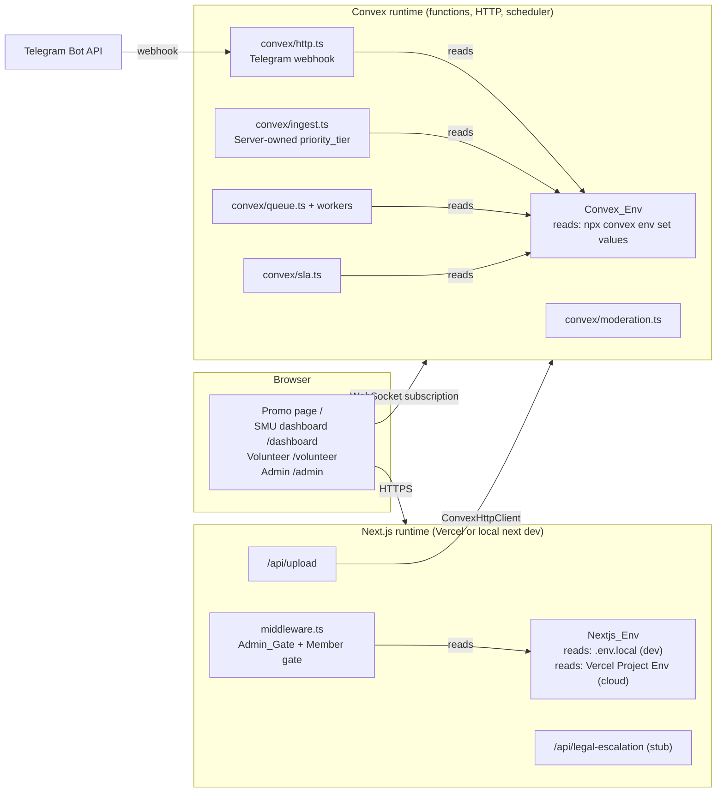
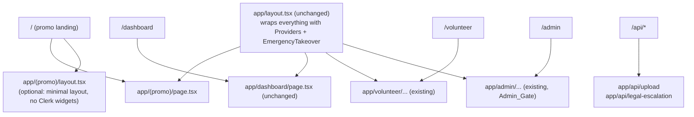
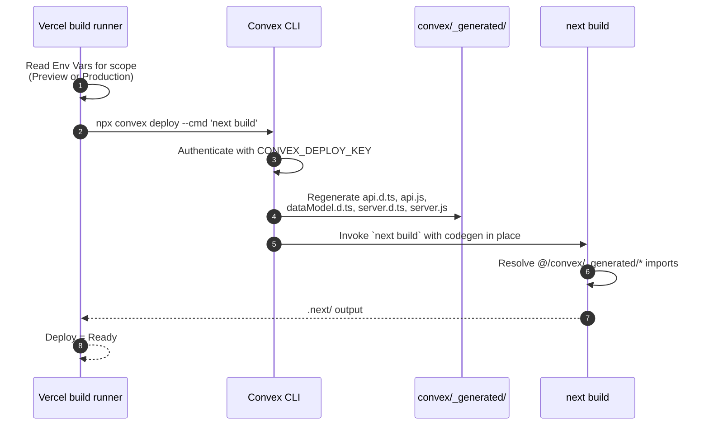

# Design Document — Session 3: Unblock, Landing Page, First Real Deploy

## Overview

Session 3 turns "code exists locally" into "Vercel Preview is green at
`sgcampuscore.hong-yi.me` with a promo landing page at `/` and the SMU app
functional on the same deployment, using a two-runtime env split that a
stranger developer can reproduce." It is a wiring session, not a product-logic
session — none of the AGENTS.md approval-checkpoint values (60 s SLA, reaper
TTL, hazard lexicon, NSFW 0.50 cutoff, dependency stack) are touched, no new
package is added, and the moderation / legal-escalation / `priority_tier`
invariants stay exactly as Session 2 left them.

Three problems are treated as one feature because they share the same root
cause (missing `convex/_generated/*`) and the same organizing decision
(Next.js/Vercel and Convex are two runtimes that do not share `process.env`):

1. **Unblock the build** — authenticate the Convex CLI with the provided
   Preview_Deploy_Key, produce `convex/_generated/`, and get `typecheck`,
   `lint`, and `build` green locally and on Vercel.
2. **Landing page + deploy** — route `/` becomes a promo page for the
   CampusCore multi-school template; `/dashboard`, `/volunteer`, `/admin`,
   `/api/*` continue to serve the SMU reference deployment on the same host.
3. **Env organization + docs** — every variable in `.env.example` is assigned
   to exactly one owning runtime (with mirrors called out explicitly), and
   `DEPLOYMENT.md` is rewritten so a fork can be brought up end-to-end from
   `git clone` to a green Vercel Preview.

The Session 2 blocker is precise: `npm run typecheck` and `npm run build` fail
because `app/dashboard/page.tsx`, `components/EmergencyTakeover.tsx`,
`app/api/upload/route.ts`, and `convex/http.ts` all import from
`@/convex/_generated/*`, which is a build artifact that Convex codegen
produces and that `.gitignore` already excludes from source control. There is
no logic to change — only tooling to run in the right order in the right
place.

### Research notes

- **Convex + Vercel Build Command.** Convex's own Vercel guide recommends
  `npx convex deploy --cmd 'next build'` as the Build Command. The `convex
  deploy` step regenerates `convex/_generated/*` against the deployment
  targeted by `CONVEX_DEPLOY_KEY` and then invokes the Next build. This is
  the mechanism that lets us keep generated files out of git.
- **Preview vs Production deploy keys.** Convex deploy keys are scoped. A
  key with a `preview:` prefix (as provided this session) can push to
  Preview deployments only; Production requires a separately generated
  `prod:` key. Vercel's Environment Variables scope (Production / Preview /
  Development) selects which `CONVEX_DEPLOY_KEY` value is used per build.
- **UNC path npm reliability.** Session 2 recorded that `cmd.exe` cannot
  reliably run npm scripts from `x:\01 REPOSITORIES\sgCampusCore2026`
  (UNC-style), and package extraction there was slow/incomplete. The
  validated workaround is a Local_Mirror at
  `C:\Users\bryan\AppData\Local\Temp\opencode\sgCampusCore2026-local` or a
  mapped drive letter. Codegen runs from the Local_Mirror; the resulting
  `convex/_generated/` is written under the Local_Mirror's tree and, because
  the two working copies point at the same repo, does not need to be
  transferred back for Vercel — Vercel regenerates it on every build via the
  Build Command above.
- **Route groups (Next.js App Router).** A directory named `(promo)` under
  `app/` is a "route group": it participates in file-system routing but its
  segment is stripped from the URL. So `app/(promo)/page.tsx` serves `/`,
  and the entire `app/(promo)/` directory can be deleted in one commit
  without changing any URL for the SMU app (`/dashboard`, `/volunteer`,
  `/admin`, `/api/*` all live outside the group).
- **Public-var boundary in Next.js.** Any env var whose name begins with
  `NEXT_PUBLIC_` is inlined into the browser bundle at build time. Anything
  else is server-only. The Public_Var whitelist for this deployment is
  intentionally minimal: `NEXT_PUBLIC_CONVEX_URL`,
  `NEXT_PUBLIC_CLERK_PUBLISHABLE_KEY`, `NEXT_PUBLIC_APP_URL`. Nothing else.

## Architecture

### Two-runtime environment topology

Next.js on Vercel and Convex are two independent runtimes with two
independent env stores. They do not share `process.env`. Every variable in
`.env.example` therefore belongs to exactly one owning runtime, with a small
set of variables **deliberately mirrored** into both.



The three mirrored variables are `TELEGRAM_WEBHOOK_SECRET`,
`CAMPUSCORE_SCHOOL_CODE`, and `CAMPUSCORE_ADMIN_ALLOWLIST`. They are mirrored
because the Next.js route handlers, the Convex webhook handler, and the
middleware Admin_Gate all need the same values but live in different
runtimes; a mismatch is a misconfiguration, not a design.

### Route topology (Session 3)

Route groups let the promo page live at `/` while the SMU app keeps every
existing URL. Nothing that already exists moves.



Two properties fall out of this shape:

1. **The `(promo)` directory is deletable.** Nothing under
   `app/dashboard/`, `app/volunteer/`, `app/admin/`, or `app/api/` imports
   from `app/(promo)/` or `components/promo/`. A fork that wants only the
   app can `rm -rf app/(promo) components/promo/` in a single commit and
   still build.
2. **Middleware behavior is unchanged.** `middleware.ts` already declares
   `/admin(.*)`, `/api/admin(.*)`, `/volunteer(.*)`, and `/api/resolve(.*)`
   as protected. `/` was implicitly public (no matcher). Route groups are
   URL-transparent, so no matcher needs a change.

### Build pipeline (Vercel)



If `CONVEX_DEPLOY_KEY` is missing, the CLI exits non-zero **before**
`next build` runs, so the Next build never sees a stale-or-missing codegen.
This is the "fail-fast" property in §Correctness Properties.

## Components and Interfaces

### C1. Convex codegen unblock

**What runs, where, in what order.**

1. Ensure the local shell environment has `CONVEX_DEPLOY_KEY` set to the
   Preview_Deploy_Key (already in `.env.convex.local`; do not print it).
2. From the Local_Mirror (not the UNC repo path), run:

   ```powershell
   npm ci --no-audit --no-fund
   npx convex dev --once
   ```

   `convex dev --once` performs a single push against the deployment
   referenced by the key and prints the deployment URL. Its side effects:
   - Writes `convex/_generated/api.js`, `api.d.ts`, `dataModel.d.ts`,
     `server.d.ts`, `server.js` into the Local_Mirror.
   - Prints the deployment URL (e.g.
     `https://<slug>.convex.cloud`), which becomes
     `NEXT_PUBLIC_CONVEX_URL`.
3. Copy the printed URL into `.env.local` (Nextjs_Env) and into the Vercel
   Project Environment Variables (Preview + Development scopes; Production
   uses a different Convex deployment and is out of scope for this session).
4. Re-run `npm run typecheck`, `npm run lint`, `npm run build` from the
   Local_Mirror. All three must exit 0 (Requirement 2).

**Fallback for UNC path unreliability.** If codegen must be run against the
UNC repo path directly, the DEPLOYMENT.md documents mapping the share to a
drive letter (`subst L: "\\\\...\sgCampusCore2026"` or the equivalent) and
running from there instead. The Vercel path never touches UNC — Vercel
clones from GitHub and runs the Build Command against a POSIX filesystem.

**`.gitignore` gap to verify.** `.gitignore` currently lists `.convex/` but
not `convex/_generated/`. The design adds `convex/_generated/` to
`.gitignore` (Requirement 1.5, Requirement 10.1). This is a
`.gitignore`-only change; no source is moved.

**Interface (commands, not code).**

```powershell
# From the Local_Mirror, once CONVEX_DEPLOY_KEY is exported:
npx convex dev --once            # writes convex/_generated/, prints URL
npx convex env set CLERK_JWT_ISSUER_DOMAIN <VALUE>
npx convex env set TELEGRAM_BOT_TOKEN <VALUE>
# ... (see §DEPLOYMENT.md structure below for the full sequence)
```

### C2. Vercel build pipeline

**Build Command.** Change the Vercel project's Build Command to:

```text
npx convex deploy --cmd 'next build'
```

**Install Command.** Accept the Vercel default (`npm ci`) — no override.

**Output Directory.** Accept the Next.js default (`.next`).

**Node version.** Match `package.json`'s implicit expectation (Next 15 +
React 19 needs Node 20+). The Vercel default (Node 20) satisfies this.

**Env vars in Vercel Project Settings.** See §5 for the full checklist. The
essentials for this session:

- Preview scope: `CONVEX_DEPLOY_KEY` = Preview_Deploy_Key,
  `NEXT_PUBLIC_CONVEX_URL` = the Preview deployment URL, plus the full
  Nextjs_Env set from Requirement 4.2.
- Production scope: same shape, but with a Prod_Deploy_Key that has not been
  generated yet. This session ships Preview only; Production is a
  documented follow-up in `WAITING_ON_HUMAN.md`.

### C3. Environment variable ownership (the two-runtime split)

The canonical assignment table (also embedded in DEPLOYMENT.md per
Requirement 4.1):

| Variable | Nextjs_Env | Convex_Env | Public? | Sensitive? | Rationale |
|---|---|---|---|---|---|
| `NEXT_PUBLIC_CONVEX_URL` | ✅ | — | ✅ | No | Convex WebSocket URL; browser needs it to open the subscription. |
| `CONVEX_DEPLOY_KEY` | ✅ (build only) | — | No | ✅ | Passed to `npx convex deploy` inside the Vercel Build Command. Never exposed at runtime. |
| `NEXT_PUBLIC_CLERK_PUBLISHABLE_KEY` | ✅ | — | ✅ | No | Clerk widget bootstrap; safe by design. |
| `CLERK_SECRET_KEY` | ✅ | — | No | ✅ | Next server-side Clerk operations (`auth()` in middleware/route handlers). |
| `CLERK_JWKS_URL` | ✅ (optional) | — | No | No | Not currently read by app code; kept for future direct verification if Convex provider is bypassed. |
| `CLERK_JWT_ISSUER_DOMAIN` | — | ✅ | No | No | Read by `convex/auth.config.ts` to verify Clerk JWTs against JWKS. |
| `TELEGRAM_BOT_TOKEN` | — | ✅ | No | ✅ | Read by Convex actions calling `sendMessage`. Must never appear in Nextjs_Env or the browser bundle. |
| `TELEGRAM_WEBHOOK_SECRET` | ✅ (mirror) | ✅ (mirror) | No | ✅ | Convex `http.ts` verifies the header; Next `/api/upload` uses it as its callback secret to Convex mutations. Mirrored so both sides accept/produce the same value. |
| `GROQ_API_KEY` | — | ✅ | No | ✅ | Only Convex actions call Groq (LLM triage). |
| `LLM_BASE_URL` | — | ✅ | No | No | Groq/Ollama base URL used by the same triage action. |
| `RESEND_API_KEY` | — | ✅ | No | ✅ | Only the Convex escalation action sends via Resend. |
| `RESEND_FROM_EMAIL` | — | ✅ | No | No | Same Convex path. |
| `RESEND_ESCALATION_TO` | — | ✅ | No | No | Same Convex path. |
| `NSFW_MODEL_URL` | — | ✅ | No | No | Consumed by `convex/lib/nsfwScorer.ts` if/when the WASM model is loaded from a URL. Leave unset until the URL is chosen (WAITING_ON_HUMAN.md). |
| `CAMPUSCORE_SCHOOL_CODE` | ✅ (mirror) | ✅ (mirror) | No | No | `config/school.ts` runs in both runtimes; both need the same active-school code. |
| `CAMPUSCORE_ADMIN_ALLOWLIST` | ✅ (mirror) | ✅ (mirror) | No | No | Middleware Admin_Gate reads it in Nextjs_Env; Convex admin-only mutations read it in Convex_Env. |
| `CSAM_SCAN_ENABLED` | ✅ | — | No | No | Read only in `app/api/upload/route.ts` (Next runtime). |
| `NEXT_PUBLIC_APP_URL` | ✅ | — | ✅ | No | Used in promo CTAs and Clerk sign-in redirects. |
| `CLOUDFLARE_UPLOAD_ENDPOINT` | ✅ (optional) | — | No | No | Not currently consumed in code; documented for future Mini-App bridge. |
| `CSOC_INTAKE_EMAIL` | — | ✅ (optional) | No | No | Legacy alias for `RESEND_ESCALATION_TO`; DEPLOYMENT.md notes to use the latter. |

Correctness properties emerging from this table (§Correctness Properties
formalizes them):

- The Public_Var set is exactly `{ NEXT_PUBLIC_CONVEX_URL,
  NEXT_PUBLIC_CLERK_PUBLISHABLE_KEY, NEXT_PUBLIC_APP_URL }`.
- `TELEGRAM_BOT_TOKEN`, `GROQ_API_KEY`, `RESEND_API_KEY`, `RESEND_*`, and
  `NSFW_MODEL_URL` never appear in the Nextjs_Env checklist.
- Mirrored variables have the same value on both runtimes (operator
  invariant; DEPLOYMENT.md calls it out).

### C4. Promo landing page (`app/(promo)/`)

**Directory layout.**

```text
app/
  (promo)/
    page.tsx        # the promo landing served at /
    layout.tsx      # minimal layout override for the promo (optional)
components/
  promo/
    Hero.tsx
    ValueProps.tsx
    ForkCta.tsx
    ReferenceDeployment.tsx
    Footer.tsx
public/
  promo/
    # any promo-only images/assets
```

**Rendering model.** `app/(promo)/page.tsx` is a **Server Component with no
Convex imports and no client-side Convex hooks**. It renders at build time /
per-request and does not require `NEXT_PUBLIC_CONVEX_URL` to be set
(Requirement 7.5). It does not gate on Clerk state — an unauthenticated
visitor sees the same content.

**Content sections (map to Requirement 7 + PRD §1 / tech_design §1-9).**

1. **Hero.** "CampusCore — a decentralized campus issue-reporting network,
   deployable per school." One paragraph of what it is and who it's for.
   Primary CTA: "Fork it for your school" → GitHub repo. Secondary CTA:
   "See the SMU reference deployment" → `/dashboard`.
2. **Value props (five capabilities).** Adapted from `tech_design.md`
   §§1–9:
   - Telegram-native reporting with inline-keyboard triage.
   - Deterministic safety floor (Aho-Corasick lexicon) — priority isn't a
     model output, it's a rule.
   - Priority-aware egress queue with an isolated emergency lane.
   - No-human-review image moderation (ONNX WASM, hash-match at edge).
   - Real-time public dashboard with True TTR / SBL metrics.
3. **Fork-and-deploy CTA.** Links to `DEPLOYMENT.md` on GitHub and lists
   the four external accounts required (Convex, Clerk, Vercel, GitHub).
4. **Reference deployment credit.** Names the SMU reference deployment,
   links to `/dashboard`, and states plainly that this domain
   (`sgcampuscore.hong-yi.me`) is the promo page for the template — SMU is
   the reference instance running underneath.
5. **Footer.** Credits, GitHub link, link to AGENTS.md hard constraints.

**Layout.** `app/(promo)/layout.tsx` is optional. If present, it exists to
suppress the SMU-app top-nav on the promo page. If absent, the promo page
handles its own top-of-page markup (there is no shared `AuthControls` on the
promo page). Root layout (`app/layout.tsx`) still wraps the promo tree with
`Providers` and `EmergencyTakeover`, but both are Convex-tolerant: `Providers`
already returns children unwrapped when `NEXT_PUBLIC_CONVEX_URL` is unset,
and `EmergencyTakeover` already `return null` in the same case.

**What happens to `app/page.tsx`.** The current `app/page.tsx` (Session 2's
hero with `AuthControls` and an "Open dashboard" CTA) is **removed** in
Session 3, because `app/(promo)/page.tsx` now serves `/`. Next.js resolves a
route-group `page.tsx` to the parent URL; two `page.tsx` files rooted at the
same URL (`app/page.tsx` and `app/(promo)/page.tsx`) is a build error. The
"authenticated app landing" concern is addressed by keeping `/dashboard` as
the entry point for authenticated users — the promo page's secondary CTA
sends them there. No new `/app` route is introduced.

**Interface (component shapes, no code yet).**

```typescript
// app/(promo)/page.tsx — Server Component
// - No imports from @/convex/*
// - No "use client" directive
// - Renders <Hero />, <ValueProps />, <ForkCta />, <ReferenceDeployment />, <Footer />
// - Reads process.env.NEXT_PUBLIC_APP_URL only for absolute links (optional)

// components/promo/*.tsx — Server Components by default
// - Only <ForkCta /> may need an anchor to the GitHub repo; still no client JS.
// - No component in components/promo/ imports from @/convex/*.
```

### C5. Vercel deploy failure diagnosis

Beyond the missing codegen, the following are anticipated as build-time
failures once codegen exists. Each has a defined resolution inside Session
3's scope; none require an AGENTS.md approval-checkpoint change.

| Symptom | Root cause | Resolution |
|---|---|---|
| `Cannot find module '@/convex/_generated/api'` in three files | Codegen missing on the Vercel build | Fixed by the Build Command change (`npx convex deploy --cmd 'next build'`). |
| TS strict-mode errors on generated types | Generated types are wider than the placeholder `Id<"tickets">` assumptions in `app/dashboard/page.tsx` | Narrow the local type aliases to match the generated `Doc<"tickets">` / `Id<"tickets">` shapes without changing runtime behavior. |
| `metadata` missing on `(promo)/page.tsx` | Root layout already defines metadata, but the promo may want its own title/description | Add a `metadata` export in `app/(promo)/page.tsx` (title: "CampusCore — deployable per school"). |
| Static asset 404 on promo | Promo images referenced but not committed under `public/promo/` | Commit assets under `public/promo/`; use only files that exist. |
| Middleware matcher regression | Route groups do not appear in URLs, so `/` still hits no matcher | No middleware change required. Verified against the current matcher config. |
| Redirect loop `/` ↔ `/dashboard` | If a stray redirect was introduced | The design explicitly forbids one (Requirement 12.5); promo page uses a `<Link>` to `/dashboard`, never a server-side redirect. |

### C6. Admin_Gate correctness (Requirement 9)

`config/school.ts::isAdminEmail` already satisfies the fail-closed property:

```typescript
export function isAdminEmail(email: string): boolean {
  if (!email) return false;
  const normalized = email.toLowerCase();
  if (!isStaffEmail(normalized)) return false;
  return getAdminAllowlist().includes(normalized);
}
```

And `getAdminAllowlist()` returns an empty array when
`CAMPUSCORE_ADMIN_ALLOWLIST` is unset or empty, so `.includes(...)` is
`false` for any input.

**No code change is required in `config/school.ts` for this session.** The
design responsibility is:

1. Add a unit test (Vitest or Node's built-in `node:test` — Vitest is not
   currently a dep and the task list forbids adding dependencies, so use
   `node:test` via `node --test`) that asserts:
   - `isAdminEmail("")` returns `false` with the allowlist unset.
   - `isAdminEmail("bryan.seah.2024@smu.edu.sg")` returns `false` with the
     allowlist unset.
   - `isAdminEmail("bryan.seah.2024@smu.edu.sg")` returns `true` after
     `process.env.CAMPUSCORE_ADMIN_ALLOWLIST` is set to that address (and
     `CAMPUSCORE_SCHOOL_CODE=smu`).
   - `isAdminEmail("outsider@gmail.com")` returns `false` even when the
     allowlist contains it (staff-domain gate).
2. Restate in DEPLOYMENT.md that the **authoritative** admin gate is
   Clerk's dashboard-level domain restriction. Middleware is
   defense-in-depth. This is a WAITING_ON_HUMAN.md item (per-school Clerk
   instance restriction) and must not be treated as "done" by any agent
   that only sees middleware pass.

If adding `node --test` friction is unwanted, an equivalent manual repro
script under `scripts/verify-admin-gate.mjs` is acceptable — either way, the
property is *checked*, not just asserted.

### C7. DEPLOYMENT.md structure

The new DEPLOYMENT.md is a fork runbook. Section outline (Requirement 11):

1. **Overview.** What this document is; who reads it (Fork_Developer).
2. **Prerequisites.** Accounts to create: Convex, Clerk, Vercel, GitHub
   fork of the repo. What each account is used for.
3. **Environment variable reference.** The full table from §C3, plus a
   plain-English column for "where to get the value" (Convex dashboard,
   Clerk dashboard, Telegram BotFather, Groq console, Resend console).
4. **Local development setup.**
   - `git clone`.
   - `npm ci`.
   - Seed `.env.local` from `.env.example`.
   - `npx convex dev --once` (this both authenticates the CLI and generates
     `convex/_generated/`).
   - Copy the printed Convex URL into `.env.local` as
     `NEXT_PUBLIC_CONVEX_URL`.
   - `npm run typecheck && npm run lint && npm run build && npm run dev`.
5. **Convex deployment env seeding.** Ordered, copy-pasteable list of
   `npx convex env set` commands with `<PLACEHOLDER>` values for every
   Convex_Env var (Requirement 6.1). Placeholders are obviously fake.
6. **Vercel setup.**
   - Create Vercel project → connect GitHub fork.
   - Set Build Command: `npx convex deploy --cmd 'next build'`.
   - Set Install Command: (default `npm ci`).
   - Set Output Directory: (default `.next`).
   - Add Environment Variables per §C3, per scope
     (Preview / Production / Development). Mark Preview requires a
     `preview:` Convex deploy key; Production requires a separately
     generated `prod:` key which is out of scope for Session 3.
   - Connect custom domain.
7. **Fork-and-deploy runbook for other schools.**
   - Confirm the school's code exists in
     `config/schoolRegistry.ts::SCHOOL_REGISTRY`. If it does, verify any
     `// verify` student subdomain against the school's IT.
   - Create a separate Clerk instance for that school, restrict signups to
     that school's domain(s) at the Clerk dashboard level.
   - Create a separate Convex project (deploy keys, `convex env set`
     sequence).
   - Set `CAMPUSCORE_SCHOOL_CODE` to the school's code in **both** Vercel
     env and Convex env.
   - Set `CAMPUSCORE_ADMIN_ALLOWLIST` in both runtimes.
   - Push a first Preview deploy; verify Convex codegen ran and Next built.
   - Delete `app/(promo)/` and `components/promo/` if the fork does not
     want the CampusCore template promo.
8. **AGENTS.md hard constraints to preserve.** Bullet list with links.
9. **Troubleshooting.** UNC path issues (Session 2 note); missing
   generated files after CLI change; Preview vs Production key confusion;
   mirrored-var mismatch symptoms.
10. **Approval-checkpoint reminder.** Explicit callout to
    `WAITING_ON_HUMAN.md`.

## Data Models

Session 3 introduces no new Convex tables, no new indexes, and no new
schema changes. The existing schema (`convex/schema.ts`) is authoritative.

The only new "data" is:

1. **Env variable ownership table.** The table in §C3 is the model. It is
   not stored in code; it lives in DEPLOYMENT.md as the operator's
   reference.
2. **Codegen artifacts.** `convex/_generated/*` — produced by the Convex
   CLI, gitignored, regenerated on every Vercel build. Not a table.
3. **Route directory structure.** `app/(promo)/` and `components/promo/`
   as described in §C4. Files, not data.

The invariants that MUST hold across Session 3 (unchanged from Session 2):

- `priority_tier` is server-owned. No client-facing mutation writes it. No
  Session 3 code path introduces such a write. This is enforced today by
  keeping the field off the argument surface of every non-internal Convex
  mutation.
- The moderation pipeline outcomes are `broadcast` or `removed` only. No
  `pending_review`. No human-review UI. Session 3 does not add one.
- The legal-escalation route (`app/api/legal-escalation/route.ts`) is a
  console-log stub. Session 3 does not touch it.

## Correctness Properties

*A property is a characteristic or behavior that should hold true across
all valid executions of a system — essentially, a formal statement about
what the system should do. Properties serve as the bridge between
human-readable specifications and machine-verifiable correctness
guarantees.*

**Scope of PBT for this feature.** Session 3 is mostly environment
configuration, build wiring, and a promo page — the kind of work
`tech_design.md` §Testing describes as "snapshot tests / schema validation
/ integration tests," not "for all inputs X, property P(X) holds."
Nonetheless, several sharply-quantified invariants **are** property-shaped
and are stated below as first-class correctness properties that later
tests (unit or grep-based) can enforce.

### Property 1: Server-vars are never exposed to the browser

*For any* variable name in the Convex-only env list
`{ TELEGRAM_BOT_TOKEN, GROQ_API_KEY, LLM_BASE_URL, RESEND_API_KEY,
RESEND_FROM_EMAIL, RESEND_ESCALATION_TO, NSFW_MODEL_URL,
CLERK_JWT_ISSUER_DOMAIN }`, the name does **not** begin with
`NEXT_PUBLIC_`, and the same name does not appear in the Vercel Project
Environment Variables checklist (per Requirement 5.6) except for the three
explicitly mirrored variables. A grep-based check over `.env.example` and
DEPLOYMENT.md can enforce this without a running system.

**Validates: Requirements 4.5, 4.6, 5.6, 10.4**

### Property 2: Admin_Gate fails closed on an empty allowlist

*For any* input email string (including the empty string, staff-domain
strings, and non-staff strings), `isAdminEmail(email)` returns `false` when
`CAMPUSCORE_ADMIN_ALLOWLIST` is unset or an empty string. Equivalently: no
email is ever admin when the allowlist is empty. Testable as a small
`node:test` suite over `config/school.ts::isAdminEmail`.

**Validates: Requirements 9.1, 9.2, 9.5**

### Property 3: The promo directory is deletable without breaking the app

*For any* file `F` referenced by any route under `app/dashboard/`,
`app/volunteer/`, `app/admin/`, `app/api/`, or `middleware.ts`, `F` does
not live under `app/(promo)/` or `components/promo/`. Equivalently:
deleting `app/(promo)/` and `components/promo/` in one commit still leaves
`npm run build` green. Testable as a grep-based check for `promo/` imports
in the app-route subtree.

**Validates: Requirements 7.7, 8.5, 12.5**

### Property 4: Build fails fast when CONVEX_DEPLOY_KEY is missing

*For any* Vercel build attempt where `CONVEX_DEPLOY_KEY` is absent from the
scope's Environment Variables, the Convex CLI exits with a non-zero status
before `next build` is invoked, and Vercel marks the deployment as failed
with the error message identifying `CONVEX_DEPLOY_KEY`. Equivalently: no
Vercel deployment can succeed with stale or missing
`convex/_generated/*`. Testable by intentionally omitting the variable
from a Preview build once.

**Validates: Requirements 1.4, 2.4, 3.4**

### Property 5: Resend escalation stays in stub mode unless fully configured

*For any* Convex_Env state where at least one of `RESEND_API_KEY`,
`RESEND_FROM_EMAIL`, or `RESEND_ESCALATION_TO` is unset, the Resend
escalation module logs the payload instead of dispatching an email.
Equivalently: partial configuration is never treated as configured. This
property already holds in Session 2's `convex/lib/resend.ts`; Session 3 must
not regress it. Testable by unit-mocking `process.env` around the module's
`sendEscalation` function (or equivalent name).

**Validates: Requirements 4.7**

### Property 6: Codegen artifacts are never committed

*For any* commit reachable from `origin/main`, the tree does not contain
files under `convex/_generated/`. Testable as a git-log grep in CI (or
manually via `git ls-files convex/_generated/` returning empty).

**Validates: Requirements 1.5, 10.1, 10.2**

### Reflection on the property set

Reviewing these six candidates against the redundancy criteria:

- P1 and P5 both concern secrets, but at different layers: P1 is about
  *variable placement* (no server var carries the `NEXT_PUBLIC_` prefix,
  no server var appears in Vercel env for Next); P5 is about *runtime
  behavior* (a partial Resend config does not dispatch email). They are
  independent — one can hold without the other.
- P2 is fail-closed on the predicate; P4 is fail-closed on the build
  pipeline. Different mechanisms, different failure modes; kept separate.
- P3 (deletable promo) and P6 (no committed codegen) are both
  "structural" invariants but over different sets — the app-route subtree
  vs. the git index. Kept separate.
- P6 is a strict superset of "codegen is regenerated per build" but is
  worded more precisely and is grep-checkable, so no additional entry is
  needed.

No property is dropped. All six are property-shaped, universally
quantified, and validate distinct requirements.

## Error Handling

Session 3 is a wiring session. The only *new* runtime error surfaces are:

1. **Codegen missing at build time (local or Vercel).** The Convex CLI
   surfaces a clear message naming the missing deployment or key. On
   Vercel, the build is marked failed; DEPLOYMENT.md's troubleshooting
   section points at "regenerate `convex/_generated/`" as the first fix.
2. **Env var missing at Next runtime.** `NEXT_PUBLIC_CONVEX_URL` unset is
   already tolerated: `Providers` renders without a Convex client,
   `DashboardSetupRequired` renders the setup state at `/dashboard`, and
   `EmergencyTakeover` returns `null`. This behavior is preserved.
3. **Env var missing at Convex runtime.** `convex/auth.config.ts` reads
   `CLERK_JWT_ISSUER_DOMAIN`; if unset, Convex functions that require an
   authenticated identity fail with a descriptive error (Requirement
   6.4). DEPLOYMENT.md's `npx convex env set` sequence is the fix.
4. **Route conflict at `/`.** If both `app/page.tsx` and
   `app/(promo)/page.tsx` exist, `next build` errors out with a duplicate
   route. The design removes `app/page.tsx` as part of the promo split;
   the removal is a single commit and must land alongside the promo
   creation.
5. **Middleware forbidden response.** Unchanged from Session 2 — 403 body
   is `"Forbidden: authorized school administrator account required."`
   for admin routes and the analogous member string for `/volunteer` and
   `/api/resolve`.
6. **`/api/legal-escalation` payload errors.** Unchanged from Session 2 —
   400 on missing fields, else console-log and 200 with `{ ok: true,
   stub: true }`.

No new error class, no new HTTP status code, no new logging path.

## Testing Strategy

Session 3 is dominated by:

- Static configuration (env variable placement, `.gitignore`, Vercel Build
  Command).
- Static text (DEPLOYMENT.md).
- A read-only marketing page (`app/(promo)/`).
- One pure-function predicate to unit-test (`isAdminEmail`).

The AGENTS.md-approved dependency stack does not include a test runner.
Adding one is out of scope for Session 3 (Requirement 2.5, 13.2). The
strategy therefore uses only what already ships with Node 20+ (`node
--test`) plus filesystem-level grep checks.

### Test types and coverage

| Property / requirement | Test type | Where it lives | How it's run |
|---|---|---|---|
| P1: no server var in `NEXT_PUBLIC_*` | grep check | `scripts/verify-env-boundary.mjs` (new, one file, no deps) | `node scripts/verify-env-boundary.mjs` before merge. |
| P2: `isAdminEmail` fail-closed | unit test | `config/school.test.mjs` (new, uses `node --test`) | `node --test config/school.test.mjs` |
| P3: deletable promo | grep check | `scripts/verify-deletable-promo.mjs` (new) | `node scripts/verify-deletable-promo.mjs` |
| P4: build fail-fast on missing key | manual integration | DEPLOYMENT.md runbook step | Toggle Vercel env var off; expect failed Preview. Verified once, then documented. |
| P5: Resend stub unless fully configured | unit test | `convex/lib/resend.test.mjs` (new if none exists; keep if it does) | `node --test convex/lib/resend.test.mjs` |
| P6: no committed codegen | grep check | `scripts/verify-no-committed-codegen.mjs` (or `git ls-files convex/_generated/`) | Run before push. |
| R2.1–2.3: local build green | integration | Local mirror | `npm run typecheck && npm run lint && npm run build`. |
| R12.1–12.3: Vercel green | integration | Vercel Preview | Visual check: build Ready, `/` returns promo, `/dashboard` returns SMU shell. |
| R8.1–8.3: SMU app reachable | integration | Local `next dev` | `GET /dashboard`, `GET /volunteer`, `GET /admin` respond as Session 2 did. |

**Property-based testing is intentionally not used.** Per this design's own
guidance, PBT is not appropriate for env configuration (schema/name
checks), for a Server Component promo page (snapshot / example is a better
fit if a test is written at all), or for one-shot build-pipeline
verification. The single truly pure function eligible for a property test
is `isAdminEmail`, and its property space is small enough that four
example cases fully cover the state machine — an example-based unit test
is more valuable than 100 randomized runs.

### Test naming and traceability

Each test file above starts with a comment referencing the design property
or requirement:

```javascript
// Feature: session-3-unblock-and-landing, Property 2:
// isAdminEmail fails closed on an empty allowlist.
```

### Manual verification checklist (for Session 3 close)

- `npm run typecheck && npm run lint && npm run build` exit 0 on the
  Local_Mirror after codegen.
- `.gitignore` contains `convex/_generated/`; `git ls-files
  convex/_generated/` returns empty.
- `.env.example` unchanged except for comment clarifications (no new
  variable added).
- DEPLOYMENT.md updated per §C7 structure.
- Vercel Preview deploy of the current branch is Ready.
- `GET /` returns the promo page (server-rendered, no Convex hooks fired).
- `GET /dashboard` returns the SMU dashboard shell (setup state if the
  operator has not yet configured Convex on the local machine — cloud
  build should be fully configured).
- `GET /api/legal-escalation` POST with a valid payload still
  console-logs and returns `{ ok: true, stub: true }`.
- `WAITING_ON_HUMAN.md` mentions the Prod_Deploy_Key follow-up.

## Rollout / Migration

Session 3 is a set of small, individually reviewable commits. Suggested
order (each is one commit unless noted):

1. **`.gitignore` + housekeeping** — add `convex/_generated/`; ensure
   `.env.convex.local` is already ignored (it is).
2. **Codegen unblock (docs only)** — DEPLOYMENT.md draft with the local
   codegen sequence and the two-runtime table. Codegen itself runs on the
   operator's machine; this commit is purely documentation.
3. **Promo scaffold** — `app/(promo)/page.tsx`, `app/(promo)/layout.tsx`
   (if adopted), `components/promo/*`, `public/promo/*`. Includes removing
   `app/page.tsx` in the same commit to avoid the duplicate-route build
   error.
4. **Admin-gate test** — `config/school.test.mjs` + one-line CI note in
   DEPLOYMENT.md. No `config/school.ts` change.
5. **Env-boundary grep scripts** — three `scripts/verify-*.mjs` files,
   one commit.
6. **Vercel config change** — Build Command update via Vercel dashboard
   (out-of-band; recorded in DEPLOYMENT.md). No file change in the repo.
7. **First green Vercel Preview** — the deploy that includes commits 1-6.
   Documented in STATUS.md at end of session.

No database migration. No schema change. No data movement. No approval
checkpoint. No new dependency.

If any step surfaces an unexpected AGENTS.md-adjacent change (e.g., a
required schema field, a new dependency, a change to the moderation
threshold), stop and flag in `WAITING_ON_HUMAN.md` — Requirement 13.6.

## Open Questions

1. **Does the promo page want its own layout?** Requirement 7 allows
   either. The current design proposes an optional
   `app/(promo)/layout.tsx` that suppresses the SMU top-nav; if we decide
   the promo page should share the root layout wholesale, we drop the
   file. Zero functional impact either way; a small aesthetic call.
2. **Where does `NEXT_PUBLIC_APP_URL` come from in dev?** In production
   it's `https://sgcampuscore.hong-yi.me`. In dev it's
   `http://localhost:3000` by convention. Confirm in DEPLOYMENT.md's local
   setup step; no code impact.
3. **Should the promo page fetch anything from GitHub at request time?**
   The design assumes no — the "See the SMU reference deployment" and
   "Fork it for your school" CTAs are static links. If a "star count" or
   similar dynamic element is wanted later, it introduces a network call
   that the Server Component would make at build/render time; not in
   Session 3 scope.
4. **When does the Prod_Deploy_Key get generated?** Explicitly deferred
   from Session 3. Recorded in `WAITING_ON_HUMAN.md`. Vercel Production
   scope remains unconfigured until then; only Preview is targeted this
   session.
5. **Do we retire `CSOC_INTAKE_EMAIL` from `.env.example`?** It appears to
   be a legacy alias for `RESEND_ESCALATION_TO`. The design proposes
   documenting it as deprecated in DEPLOYMENT.md without removing it from
   `.env.example` (to avoid touching more surface than needed). Confirm
   before the docs commit.

